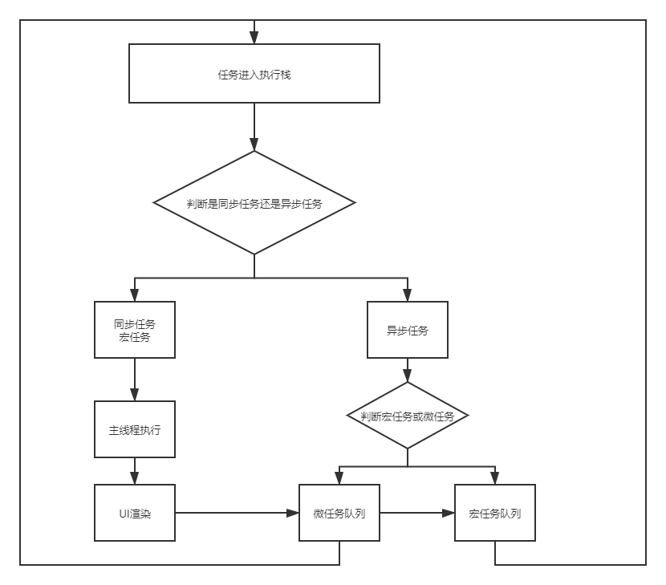

### Event Loop

- Event Loop 即事件循环,JavaScript的运行机制

在JavaScript中，任务被分为两种，一种宏任务（MacroTask）也叫Task，一种叫微任务（MicroTask）。

宏任务:

 script全部代码、setTimeout、setInterval、setImmediate（浏览器暂时不支持，只有IE10支持，具体可见MDN）、I/O、UI Rendering

 微任务:

 Process.nextTick（Node独有）、Promise、Object.observe(废弃)、MutationObserver

 Javascript单线程任务被分为同步任务和异步任务，同步任务会在调用栈中按照顺序等待主线程依次执行，异步任务会在异步任务有了结果后，将注册的回调函数放入任务队列中等待主线程空闲的时候（调用栈被清空），被读取到栈内等待主线程的执行。

 任务队列Task Queue，即队列，是一种先进先出的一种数据结构。

 执行栈在执行完同步任务后，查看执行栈是否为空，如果执行栈为空，就会去检查微任务(microTask)队列是否为空，如果为空的话，就执行Task（宏任务），否则就一次性执行完所有微任务。
每次单个宏任务执行完毕后，检查微任务(microTask)队列是否为空，如果不为空的话，会按照先入先出的规则全部执行完微任务(microTask)后，设置微任务(microTask)队列为null，然后再执行宏任务，如此循环。

#### 如图


#### 举个例子

```js 
console.log('script start');

setTimeout(function() {
  console.log('setTimeout');
}, 0);

Promise.resolve().then(function() {
  console.log('promise1');
}).then(function() {
  console.log('promise2');
});
console.log('script end');

```
